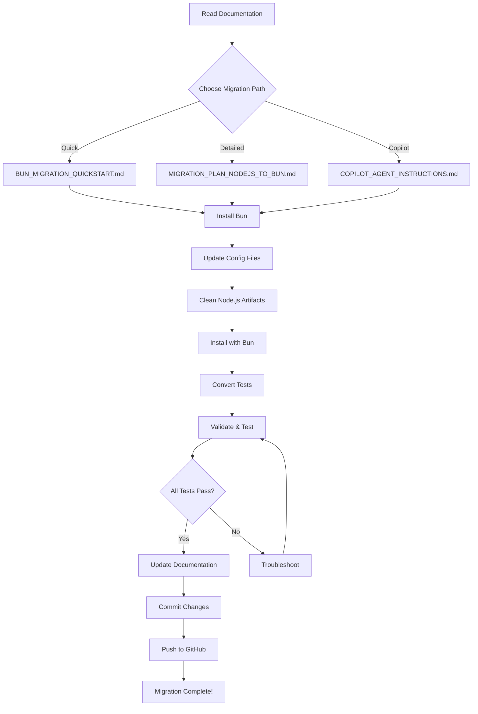

# Node.js → Bun Refactoring Project Index

## 📚 Documentation Overview

This repository contains comprehensive migration plans for refactoring the Virtual IP Browser from Node.js/npm to Bun runtime.

---

## 🗂️ Migration Documents

### 1. **Quick Start Guide** 
**File**: `BUN_MIGRATION_QUICKSTART.md`

**Purpose**: Fast-track migration in 5 steps

**Best For**:
- Developers who want to migrate immediately
- Quick reference during migration
- Understanding key changes at a glance

**Contents**:
- 5-step migration process
- Command comparison table (npm vs Bun)
- Validation checklist
- Common issues & fixes
- Rollback procedure

**Time**: 15-30 minutes to complete

---

### 2. **Detailed Migration Plan**
**File**: `MIGRATION_PLAN_NODEJS_TO_BUN.md`

**Purpose**: Comprehensive 12-phase migration strategy

**Best For**:
- Understanding the complete migration scope
- Planning and risk assessment
- Team coordination
- Performance benchmarking

**Contents**:
- 12 detailed phases with sub-steps
- Configuration file updates
- Test migration patterns
- Performance benchmarking guide
- Documentation update checklist
- CI/CD updates
- Team training materials
- Success criteria

**Time**: 2-4 hours for full migration

---

### 3. **GitHub Copilot Agent Instructions**
**File**: `COPILOT_AGENT_INSTRUCTIONS.md`

**Purpose**: Step-by-step automated migration guide

**Best For**:
- Using GitHub Copilot Workspace/Chat
- Automated code refactoring
- Following a structured approach
- Validation at each step

**Contents**:
- 9 execution phases
- Copilot-specific prompts
- Validation commands
- Troubleshooting procedures
- Post-migration verification
- Success metrics tracking

**Time**: 2-4 hours (mostly automated)

---

## 🎯 Migration Strategy

### Choose Your Path

```
┌─────────────────────────────────────────────────┐
│  How do you want to migrate?                    │
├─────────────────────────────────────────────────┤
│                                                  │
│  ⚡ Quick & Manual                               │
│  → Use: BUN_MIGRATION_QUICKSTART.md             │
│  → Time: 15-30 min                               │
│  → Best if: You know the codebase well           │
│                                                  │
│  📋 Comprehensive & Planned                      │
│  → Use: MIGRATION_PLAN_NODEJS_TO_BUN.md         │
│  → Time: 2-4 hours                               │
│  → Best if: Need detailed documentation          │
│                                                  │
│  🤖 Automated with Copilot                       │
│  → Use: COPILOT_AGENT_INSTRUCTIONS.md           │
│  → Time: 2-4 hours (mostly automated)            │
│  → Best if: Using GitHub Copilot                 │
│                                                  │
└─────────────────────────────────────────────────┘
```

---

## 🔄 Migration Workflow

### Standard Process



---

## 📦 What Changes in Migration

### Configuration Files
- ✏️ `ui-tauri/package.json` - Scripts updated for Bun
- ✏️ `ui-tauri/src-tauri/tauri.conf.json` - Build commands updated
- ✏️ `ui-tauri/tsconfig.json` - Bun types added
- ✏️ `.gitignore` - Bun artifacts added
- ➕ `ui-tauri/bunfig.toml` - New Bun config (optional)

### Dependencies
- ❌ Remove: `vitest`, `@vitest/ui`
- ➕ Add: `bun-types`
- ♻️ All other packages stay the same

### Test Files
- ✏️ Import from `'bun:test'` instead of `'vitest'`
- ✏️ Use `test()` instead of `it()`
- ✏️ Use `mock()` instead of `vi.fn()`

### Artifacts
- ❌ Remove: `node_modules/`, `package-lock.json`
- ➕ Add: `bun.lockb`

---

## 🚀 Performance Improvements

### Expected Gains

| Metric | Before (npm) | After (Bun) | Improvement |
|--------|--------------|-------------|-------------|
| Install Time | ~30-60s | ~10-20s | **50-70% faster** |
| Test Execution | ~5-10s | ~2-4s | **2-3x faster** |
| Dev Server Start | ~3-5s | ~2-3s | **30-40% faster** |
| TypeScript Execution | Transpiled | Native | **Instant** |
| Disk Space | ~500MB | ~350MB | **30% less** |

---

## ✅ Pre-Migration Checklist

Before starting migration:

- [ ] Code committed to Git
- [ ] Clean working directory (`git status`)
- [ ] Baseline tag created (`v1.0.0-nodejs-baseline`)
- [ ] Team notified (if applicable)
- [ ] Read appropriate migration guide
- [ ] Bun installation verified

---

## 🎯 Post-Migration Checklist

After completing migration:

- [ ] All tests pass (`bun test`)
- [ ] Dev server works (`bun run dev`)
- [ ] Tauri app launches (`bun run tauri`)
- [ ] Production build succeeds (`bun run tauri:build`)
- [ ] Documentation updated
- [ ] Changes committed and pushed
- [ ] Migration tag created
- [ ] Performance benchmarks recorded

---

## 🔍 Key Files Modified

### Critical Updates
1. `ui-tauri/package.json` - Change all npm commands to Bun
2. `ui-tauri/src-tauri/tauri.conf.json` - Update beforeDevCommand & beforeBuildCommand
3. `ui-tauri/tsconfig.json` - Add bun-types
4. `.gitignore` - Add Bun artifacts

### Test Files
- `**/*.test.ts` - Convert Vitest → Bun test
- `**/*.spec.ts` - Convert Vitest → Bun test

### Documentation
- `README.md` - Update prerequisites and commands
- `GETTING_STARTED.md` - Update setup instructions

---

## 🛠️ Commands Reference

### Installation
```bash
# Install Bun
irm bun.sh/install.ps1 | iex

# Verify installation
bun --version
```

### Migration
```bash
# Clean Node.js artifacts
cd ui-tauri
Remove-Item -Recurse -Force node_modules, package-lock.json

# Install with Bun
bun install
```

### Development
```bash
# Start dev server
bun run dev

# Launch Tauri app
bun run tauri

# Run tests
bun test

# Build production
bun run tauri:build
```

### Validation
```bash
# Check types
bun run check

# Lint code
bun run lint

# Format code
bun run format
```

---

## 📊 Migration Phases Overview

### Phase 1: Preparation (15 min)
- Install Bun
- Create baseline backup
- Review dependencies

### Phase 2: Configuration (15 min)
- Update package.json
- Update tauri.conf.json
- Update tsconfig.json
- Update .gitignore

### Phase 3: Dependencies (10 min)
- Remove Node.js artifacts
- Install with Bun
- Add Bun types

### Phase 4: Test Migration (30 min)
- Find all test files
- Convert Vitest → Bun test
- Update imports

### Phase 5: Validation (45 min)
- Test dev server
- Test Tauri dev
- Test production build
- Run all tests
- Verify types & linting

### Phase 6: Documentation (20 min)
- Update README
- Update GETTING_STARTED
- Create migration notes

### Phase 7: Finalization (10 min)
- Commit changes
- Create tag
- Push to GitHub

**Total Time**: 2-4 hours

---

## 🆘 Troubleshooting

### Common Issues

**Issue**: Bun command not found
```powershell
# Restart PowerShell after installation
# Or reinstall: irm bun.sh/install.ps1 | iex
```

**Issue**: TypeScript errors
```powershell
cd ui-tauri
bun add -d bun-types
# Verify tsconfig.json includes "bun-types"
```

**Issue**: Tests fail
```typescript
// Check imports - should be:
import { test, expect } from 'bun:test';
// NOT:
import { it, expect } from 'vitest';
```

**Issue**: Build fails
```powershell
# Test Vite separately first
bun run build

# Then test Tauri
bun run tauri:build
```

---

## 🔄 Rollback Procedure

If critical issues occur:

```powershell
# Checkout baseline
git checkout v1.0.0-nodejs-baseline

# Reinstall with npm
cd ui-tauri
npm install

# Verify works
npm run tauri
```

---

## 📈 Success Metrics

Track these before and after migration:

1. **Installation Speed**: `Measure-Command { bun install }`
2. **Build Speed**: `Measure-Command { bun run build }`
3. **Test Speed**: `Measure-Command { bun test }`
4. **Dev Server Start**: Time from `bun run dev` to "ready"
5. **Hot Reload Speed**: Time to reflect code changes

---

## 🎓 Learning Resources

### Bun Documentation
- Official Docs: https://bun.sh/docs
- GitHub: https://github.com/oven-sh/bun
- Discord: https://bun.sh/discord

### Integration Guides
- Bun + Vite: https://bun.sh/guides/ecosystem/vite
- Bun + TypeScript: https://bun.sh/docs/runtime/typescript
- Bun Test Runner: https://bun.sh/docs/cli/test

### Project Specific
- Tauri Docs: https://tauri.app/
- Svelte Docs: https://svelte.dev/
- Virtual IP Browser: See README.md

---

## 🎯 Why Migrate to Bun?

### Developer Experience
- ⚡ **Faster everything**: Install, build, test, run
- 🎯 **All-in-one tool**: Runtime + package manager + bundler + test runner
- 🔥 **Native TypeScript**: No transpilation needed
- 📦 **Smaller footprint**: Less disk space, faster CI/CD

### Technical Benefits
- 🚀 Built with Zig (performance-focused)
- 🔧 Drop-in Node.js replacement (same APIs)
- 🧪 Built-in test runner (no Vitest/Jest needed)
- 📊 Better error messages and stack traces

### Business Benefits
- ⏱️ Faster development iterations
- 💰 Lower CI/CD costs (faster builds)
- 🎓 Simpler stack (fewer tools to learn)
- 🔮 Future-proof (actively developed)

---

## 📋 Document Change Log

| Date | Document | Changes |
|------|----------|---------|
| 2024 | All files created | Initial migration plans |

---

## 🤝 Contributing

If you find issues or have improvements:

1. Test the migration thoroughly
2. Document any issues encountered
3. Update relevant migration docs
4. Create pull request with improvements

---

## 📄 License

Same as project license (MIT OR Apache-2.0)

---

## 🎉 Ready to Start?

Choose your migration path:

1. **Quick Migration**: Start with `BUN_MIGRATION_QUICKSTART.md`
2. **Detailed Planning**: Read `MIGRATION_PLAN_NODEJS_TO_BUN.md`
3. **Copilot Automation**: Follow `COPILOT_AGENT_INSTRUCTIONS.md`

**First step for all paths**: Install Bun
```powershell
irm bun.sh/install.ps1 | iex
```

---

**Questions?** Check the troubleshooting sections in each guide or visit https://bun.sh/discord

**Ready when you are!** 🚀
